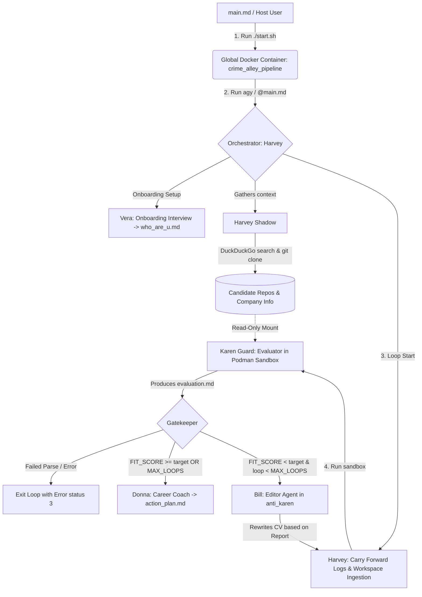

# Crime Alley CV: An Actor-Critic CV Optimization & Integrity Engine


Automated CV optimization and verification system based on a multi-agent **Actor-Critic** architecture. An orchestrator drives a feedback loop where a critic agent (**Karen**) audits the CV against real, cloned code evidence, and an editor agent (**Bill**) rewrites it until the score meets a target acceptance threshold.

> [!NOTE]
> **Environment Stability & Podman Migration (June 2026) - Resolved ✅**
> We have successfully migrated the sandboxed subagent runtime from Docker to nested Podman to prevent socket-exposure security risks. All nested runtime configurations (storage, network/firewall, and user permissions) and authentication loop checks have been stabilized and validated via automated unit tests.

> **Study note: What this demonstrates.** 
> This is a study and practical utility project on orchestrating a multi-agent system primarily in **natural language runbooks**, using deterministic code only where it is strictly required to prevent silent failures. It is intentionally **framework-free** (no LangGraph, CrewAI, Autogen, etc.): the orchestration lives in readable runbooks (`.md` files), and the system boundary is enforced via structured container sandboxing. The artifact worth reviewing here is the software engineering discipline: the reasoning, the prose/code boundary, the security isolation model, the explicit contracts, and the debugging telemetry.

---


## 🗺️ System Architecture



### Execution Loop Lifecycle
1. **Phase 0 — Dependency Verification**: A subagent (`Dependency Checker`) verifies host dependencies (`python`, `uv`, `docker`/`podman`, `at`, `git`, `wl-copy`).
2. **Phase 1 — Interactive Setup**: The orchestrator prompts the user for configuration limits (`MAX_LOOPS`, `MIN_FIT_SCORE`, `JOB_DESCRIPTION_RAW`, `KAREN_READS_BACKGROUND`).
3. **Phase 1.5 — Onboarding (Optional)**: If the candidate profile (`who_are_u.md`) does not exist, **Vera** conducts a roleplay interview to create it.
4. **Step 1 — Environment & Setup**: **Harvey** creates an isolated workspace under `/tmp/karen_guard_<UUID>/` and carries forward historical run files. **Harvey Shadow** concurrently clones the candidate's public repositories and researches the company.
5. **Step 2 — Skeptical Audit**: **Karen Guard** executes inside a containerized sandbox, evaluating the candidate's CV statements against actual code implementation patterns.
6. **The Gatekeeper**: The evaluation report is parsed by a deterministic Python module to check exit conditions.
7. **Step 3 — CV Revision**: **Bill** analyzes the gap report in a protected zone (`anti_karen/`) and refines `cv.md` for the next loop.
8. **Post-Loop Coaching**: Once the target score is hit or loop boundaries are reached, **Donna** translates remaining gaps into a professional development road map (`action_plan.md`).

---

## 🤖 Agent Roster

| Avatar | Agent | Directory | Runtime | Responsibility |
|---|---|---|---|---|
|  | **Vera** | `vera_psyco/` | prose agent | Onboarding interview & context collector $\rightarrow$ `who_are_u.md` |
|  | **Harvey** | `harvey_guy/` | Python + prose runbook | Orchestration coordinator, path resolution, and state directory initialization. |
|  | **Harvey Shadow** | `harvey_guy/` | prose agent | Parallel task runner: queries DuckDuckGo, clones target repos, pre-builds sandbox. |
|  | **Karen Guard** | `karen_guard/` | Gemini CLI in sandbox | Skeptical critic: compares CV claims against cloned code, produces evaluation. |
|  | **Bill** | `billf/` | prose agent | CV Actor: revises resume in `anti_karen/` based on Karen's feedback. |
|  | **Donna** | `donna_nana/` | prose agent | Post-loop coach: analyzes final score and creates the `action_plan.md`. |

---

## 🧪 Design Decisions & Philosophy

### 1. The Prose Orchestration Bet
In this project, `.md` files are not static documentation—they are **executables** interpreted by agent clients (`agy`, `Claude Code`). The bet is that a capable reasoning model is a robust "interpreter" for prose runbooks, offering readability and auto-healing capabilities that outweigh the rigidity of a typical workflow engine.

### 2. Prose vs. Code: "Migrate Only What Fails Silently"
The core heuristic guiding this codebase is: **what fails loudly should live in prose; what fails silently must live in code.**

* **Fails Loudly**: A missing file, a directory permission error, or a wrong command syntax. The agent runtime detects these errors natively and self-heals by rewriting the command or creating the directory. Hardcoding these scenarios creates brittle code.
* **Fails Silently**: 
  1. *History Accumulation*: If Bill writes a CV draft but the next iteration forgets to carry it forward, the loop runs with the *original* CV. The system completes without errors, but the scores stall. We migrated this to Python (`harvey_guy.py`) to systematically copy `anti_karen/karen_guard_core.log` and `cv.md` between iterations.
  2. *Score Extraction*: If Karen writes `Technical Fit Score: 85/100` and Bill changes the layout next run to `Score - 80`, a rigid string-matcher would crash, but a soft LLM check might pass a hallucinated score. We hardened this into a deterministic Python validator ([gatekeeper.py](harvey_guy/gatekeeper.py)) that uses robust regex patterns to extract scores and map exit codes:
     - `exit(0)`: Target met (Success).
     - `exit(1)`: Loops exhausted (Max Loops reached).
     - `exit(2)`: Threshold not met (Continue Loop).
     - `exit(3)`: Parsing error (Fails loudly, halting execution).

| Concern | Fails How? | Lives Where | Implementation |
|---|---|---|---|
| Score parsing, bounds validation | Silently (hallucinated score or runaway loops) | Code | [gatekeeper.py](harvey_guy/gatekeeper.py) |
| CV carry-forward & workspace layout | Silently (loops evaluate same base resume) | Code | [harvey_guy.py](harvey_guy/harvey_guy.py) |
| Onboarding, Critic & Editor judgment | "Worse result" (lacks context or style) | Prose | `main.md` runbooks |
### 3. Decoupling Agent Logic: Fast Testing via Mocking
To prevent wasting LLM tokens and make testing deterministic, we decouple environment and wrapper script validation from the agents themselves. By checking in actual runtime files (e.g. `company_info.md`, `repos.json`, and agent outputs) under [tests/mocks/](file:///home/alex/git/my/meta_2028/tests/mocks/) and utilizing mock wrapper binaries (such as mocking `podman` or `docker` commands in a localized sub-shell `PATH`), we can test the pipeline's control flow, directory structure mappings, and authentication verification rules in Python unit tests. This ensures our non-agent components (like setup scripts, environment validators, and local firewall setups) are completely testable and functional offline, without spawning container daemons or consuming LLM quotas.

---

## 🎓 Theoretical Alignment & Academic Foundation

This architecture directly implements the agentic design patterns established in Anthropic's research on effective agent systems [1] and aligns with academic work on multi-agent software engineering and self-feedback loops:

1. **The Orchestrator-Workers Pattern (ChatDev)**:
   The coordinator **Harvey** acts as the central orchestrator, managing state variables, initializing environments, and delegating specific sub-tasks to specialized worker agents (**Vera**, **Harvey Shadow**, **Karen**, and **Bill**). This role-based isolation aligns with the multi-agent roleplay paradigm explored in *ChatDev* [2], where specialized agents collaborate sequentially to achieve complex goals.
2. **The Evaluator-Optimizer Pattern (Self-Refine)**:
   The core refinement loop is a classic Evaluator-Optimizer workflow. **Bill** (the Optimizer) proposes modifications to the CV, while **Karen Guard** (the Evaluator) acts as a strict, sandbox-isolated critic. This iterative loop implements the feedback and self-correction principles detailed in the *Self-Refine* framework [3], demonstrating that iterative evaluation and refinement dramatically improve output alignment and precision.
3. **The Workflows vs. Agents Boundary**:
   Following Anthropic's recommendations [1], autonomous model-driven routing is used only where judgment is required (e.g. CV auditing and rewrite planning), while deterministic code (Python, shell) is utilized to enforce strict control flows, state carry-over, and parsing boundaries, avoiding silent LLM failures.

---

## 🔒 Security & Sandbox Isolation Layout

The architecture enforces a physical separation between the untrusted code being audited and the privileged orchestrator environment.

### 1. Workspace Directory Partitioning
Each execution creates a dynamic session path under `/tmp/karen_guard_<UUID>/`:

```
/tmp/karen_guard_<UUID>/
├── docs/           ← cv.md, job.md, who_are_u.md   (Mounted read-only to Karen)
├── repos/          ← Cloned target repositories     (Mounted read-only to Karen)
├── company_info.md ← Company research profile      (Mounted read-only to Karen)
├── out/            ← Evaluator's target output      (Mounted write-only to Karen)
└── anti_karen/     ← PROTECTED ZONE (Not mounted into Karen's container)
    ├── karen_output.md
    └── karen_guard_core.log
```

Because `anti_karen/` is physically omitted from the sandbox container, **Karen Guard** has zero path visibility into historical logs, past drafts, or candidate onboarding notes, preventing prompt injection attacks and context contamination.

### 2. Nested Sandboxing (Podman-in-Docker)
When running inside a containerized setup, exposing `/var/run/docker.sock` from the host allows containers to spawn sibling containers that bypass host access controls (privilege escalation). 

To prevent this, the global system uses a **Podman-in-Docker** topology:
* The outer container (`crime_alley_pipeline`) runs with `--privileged` to support nested cgroups.
* The inner sandbox runs using **Podman** in rootless mode with user namespaces enabled (`--userns=keep-id`).
* Inner container storage is configured to use the `vfs` driver inside `/etc/containers/storage.conf` to avoid host driver conflicts.
* This ensures that even if Karen executes arbitrary test scripts within a cloned repository, the process remains restricted to a nested rootless user space with no path back to the host system.

---

## ⚡ Token Management & Cost Optimization

Multi-agent optimization cycles traversing large repositories can easily exhaust API token quotas. The pipeline implements three layers of cost control:

1. **Global Ignore Engine (`.agentignore`)**:
   Filters out irrelevant project structures (e.g., `node_modules`, `uv.lock`, `.git`, binary files, lockfiles, images) from being ingested by **any** agent in the pipeline.
2. **Gemini Context Caching**:
   Static assets (such as the cloned repositories and the raw job description) are cached on the Gemini API side. Refinement iterations only pay for the delta of the newly generated CV drafts and feedback reports, dropping token cost by up to 90% in subsequent runs.
3. **Telemetry Tracking**:
   Every run archives detailed iteration data to `.runs/<timestamp>/scores.csv` and compiles a token footprint log to monitor optimization efficiency.

---

## 🛠️ Execution & Debugging Guide

### 🚀 Running the System

#### Option A: Containerized (Recommended)
1. **Start the pipeline container**:
   ```bash
   ./start.sh
   ```
   *Note: This script mounts your host credentials (`~/.gemini` to `/root/.gemini`) dynamically, ensuring authorization persists inside the container.*
2. **Launch the agent CLI inside the shell**:
   ```bash
   agy
   ```
3. **Trigger the loop**:
   > **User Prompt**: `@main.md`

#### Option B: Direct Host Execution
1. Ensure your host shell matches the requirements in [requirements.md](requirements.md).
2. Start your local agent client:
   ```bash
   agy
   ```
3. Trigger the runbook:
   > **User Prompt**: `@main.md`

---

### 🔍 Debugging & Troubleshooting

#### 1. Tracking /tmp Context Status
Because the orchestrator delegates parallel tasks to `Harvey Shadow`, you can monitor file construction in real-time. Open a secondary terminal on the host and run:

```bash
# Verify directory tree generation inside the container
docker exec -it $(docker ps -lq) tree -L 3 -a /tmp
```

This output will highlight if cloned repositories are correctly isolated or if `company_info.md` was successfully written.

#### 2. Resolving Agent Approval Loops (`ManageTask`)
When runbooks spawn sub-agents (e.g., `Dependency_Checker` or `Harvey Shadow`), the client may halt and request confirmation (e.g., `ctrl+K to approve ManageTask`). 

To bypass this loop and authorize the sub-agents to manage tasks autonomously, append `"mcp(*)"` permissions in your configuration:
* File: `~/.gemini/config/config.json` (or `/root/.gemini/config/config.json` inside the container)
* Setting:
  ```json
  {
    "permissions": {
      "mcp": ["*"]
    }
  }
  ```

#### 3. Testing Deterministic Parts
To validate that changes to path configurations or score regex patterns do not introduce regressions, run the unit test suite:
```bash
uv run pytest
```
Tests are located in [tests/](tests/) and mock the file system inputs to test directory isolation, history log carry-forward, and score checks.

---

## 📚 References

[1] E. Schluntz and B. Zhang, "Building Effective Agents," Anthropic, Dec. 2024. [Online]. Available: https://www.anthropic.com/research/building-effective-agents

[2] C. Qian et al., "Communicative Agents for Software Development," in *Proceedings of the 62nd Annual Meeting of the Association for Computational Linguistics (ACL)*, 2024. arXiv preprint arXiv:2307.07924.

[3] A. Madaan et al., "Self-Refine: Iterative Refinement with Self-Feedback," *arXiv preprint arXiv:2303.17651*, 2023.
