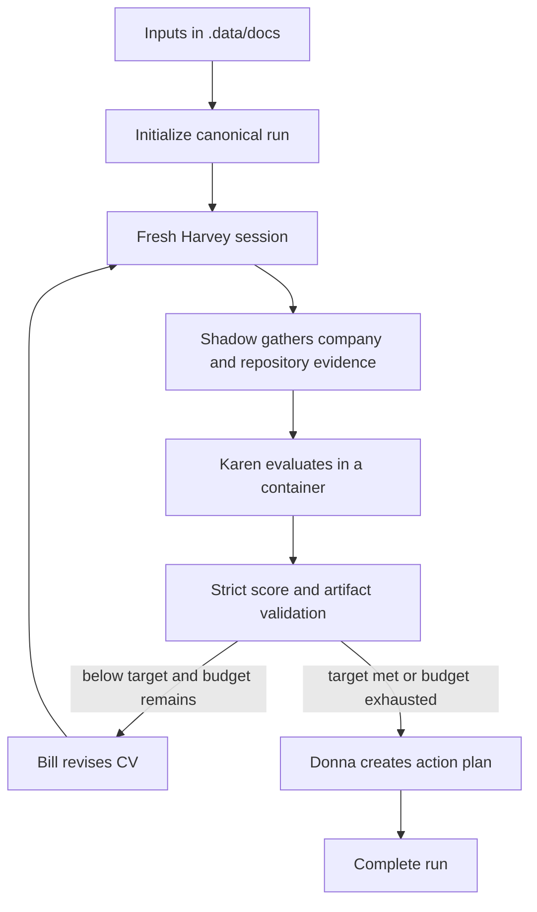

# Crime Alley CV: Actor-Critic CV Optimization & Integrity Engine


Automated CV optimization and verification based on an actor-critic architecture. Karen audits a
CV against a target role and repository evidence, Bill revises it from the structured criticism,
and Donna turns the remaining gaps into a development plan. Models own judgment; deterministic
Python owns state transitions, limits and artifact validation.

> **Study note.** This project studies multi-agent orchestration primarily through readable natural
> language runbooks, using deterministic code where ambiguity can fail silently. It intentionally
> avoids orchestration frameworks such as LangGraph, CrewAI and AutoGen. The engineering artifact is
> the boundary between prose and code: explicit contracts, isolated roles, durable evidence,
> recovery and offline replay.

This is a forward-only MVP. Python is the sole state owner; thin Fish boundary scripts validate
each handoff and append run-scoped audit events without duplicating counters or transition rules.

## System architecture


```mermaid
flowchart TD
    A[Inputs in .data/docs] --> B[Initialize canonical run]
    B --> C[Fresh Harvey session]
    C --> D[Shadow gathers company and repository evidence]
    D --> E[Karen evaluates in a container]
    E --> F[Strict score and artifact validation]
    F -->|below target and budget remains| G[Bill revises CV]
    G --> C
    F -->|target met or budget exhausted| H[Donna creates action plan]
    H --> I[Complete run]
```

The only control-flow source of truth is `.runs/<run-id>/state.json`. It records the phase,
completed evaluations, latest score, active session, guard digests and terminal outcome.
Transitions are locked, staged under `transactions/` and journaled in `events.jsonl`. Interrupted
commits are replayed only after their strict manifest, revision, operation-specific targets and
payload hashes pass validation. Evaluated inputs and outputs are archived in `iterations/`.

The model-facing execution guide is [harvey_guy/main.md](harvey_guy/main.md); the deterministic
state machine is [harvey_guy/pipeline.py](harvey_guy/pipeline.py).

### Execution lifecycle

1. Verify host dependencies from [requirements.md](requirements.md).
2. Collect `MAX_ITERATIONS`, `MIN_FIT_SCORE`, the job description and the background-visibility
   choice.
3. Optionally let Vera create `who_are_u.md` through an onboarding interview.
4. Initialize a canonical run and start a fresh Harvey session.
5. Harvey Shadow researches the company and clones public repository evidence.
6. Karen evaluates the current CV in the evaluator container.
7. The control plane validates exactly one canonical score and either prepares Bill or ends the
   optimization loop.
8. Bill revises only the CV; an integrity guard must pass before it is carried forward.
9. Donna writes a new action plan; its read-only inputs are checked before the run becomes complete.

## Agent roster

| Avatar | Agent | Directory | Responsibility |
|---|---|---|---|
|  | **Vera** | `vera_psyco/` | Optional onboarding interview and candidate background |
|  | **Harvey** | `harvey_guy/` | Deterministic orchestration, state and fresh sessions |
|  | **Harvey Shadow** | `harvey_guy/` | Company research and repository acquisition |
|  | **Karen Guard** | `karen_guard/` | Skeptical evidence-based CV evaluation |
|  | **Bill** | `billf/` | CV revision from Karen's validated report |
|  | **Donna** | `donna_nana/` | Post-loop development and interview action plan |

## Design decisions

### The prose orchestration bet

The Markdown files in this repository are executable instructions interpreted by agent clients,
not merely passive documentation. Prose remains useful for interviewing, research, evaluation and
editing because those tasks require contextual judgment. Code owns anything whose ambiguity could
silently corrupt the workflow.

The practical rule is: **judgment lives in prose; invariants live in code.**

### The frontier-model bet

Agent work is inherently nondeterministic: the same inputs, model family and runbook may still
produce different reasoning paths and artifacts. This project does not claim to reproduce an
agent's hidden reasoning or make one provider universally superior. Provider quality depends on
the task, model generation and surrounding tools, so agy, Claude Code and Codex are treated as
replaceable execution clients behind the same explicit boundaries.

The architectural bet is that future frontier models will be increasingly capable of using an
open, prose-driven workspace, while the surrounding system remains responsible for confinement.
The reproducible unit is therefore **the environment, inputs, contracts, limits and execution
evidence—not the model's exact reasoning**. Containers, typed state transitions, immutable
snapshots, validation and audit logs narrow the consequences of nondeterministic work without
pretending to eliminate it.

This is a research and engineering direction, not proof that the current architecture is optimal
for every workload. Stronger isolation still requires deployment-level controls, and successful
replay demonstrates control-flow behavior rather than identical future model output.

| Concern | Failure mode | Owner |
|---|---|---|
| Phase, iteration and termination | Silent extra or infinite loops | `harvey_guy.pipeline` |
| Score parsing and range | Hallucinated or ambiguous gate result | `harvey_guy.evaluation` |
| Artifact carry-forward | Re-evaluating an old CV | Transactional control plane |
| Bill and Donna write boundaries | Inputs changed while output is accepted | Digest-anchored guards |
| Interviews, criticism and rewriting | Quality depends on context | Agent runbooks |

### Deterministic contracts

- A run has one canonical state file; runbooks never maintain a parallel counter.
- `MAX_ITERATIONS` counts Karen evaluations and stops exactly at that boundary.
- A Karen report has exactly one `## Technical Fit Score: N/100` line, with ASCII `N` from 0 to 100.
- Every evaluation starts in a fresh session. Historical reports and drafts are not copied into the
  next context.
- Bill must change the CV and may not mutate the host worktree, canonical inputs, inventories,
  reports or cloned repositories.
- Donna must create content that differs from the prior action plan and may not mutate either
  reachable CV/job copy, the archived final evaluation, session repositories or host worktree.
- The Karen wrapper publishes only into its session. `record-evaluation` publishes
  `.data/evaluation.md` only after parsing succeeds, in the same recoverable transition.
- Tests and offline replay use temporary data, run and session roots.

### Offline-first testing

Agent and provider calls are separated from the deterministic control plane. Tests use mock
container commands and temporary filesystem roots to validate transitions, recovery, score parsing,
authentication-flow detection and file boundaries without spending model quota. Recorded Karen
reports can replay a full three-evaluation loop without an agent CLI or network access.

## System requirements

- **Operating system:** Linux. Nested containers, user namespaces and the current shell scripts are
  Linux-specific.
- **Python environment:** `uv` with the project `.venv/`.
- **Container engine:** Podman or Docker, as described in [requirements.md](requirements.md).
- **Other tools:** Git and `jq`; the full list and supported versions live in the requirements file.
- **Disk:** allow substantial space for the outer environment, evaluator image and cloned public
  repositories. Ten GB free is a practical starting point for the current setup.

The current image footprint favors explicit dependencies, inspectability and broad CLI
compatibility over minimum size. It is not presented as an irreducible requirement: multi-stage
builds, a distroless or otherwise minimal runtime, and manually verified shared libraries could
reduce it. Such optimization should be measured per layer and accepted only after authentication,
network, certificate, sandbox and end-to-end provider tests pass; replacing the base distribution
alone is not assumed to save most of the footprint.

Container builds use content-addressed Python and `uv` images, a dated Debian snapshot and fixed
agy, Claude Code and Codex releases. Their amd64/arm64 artifacts are checked against pinned SHA-512
or SHA-256 values before installation. These pins live in both Dockerfiles and the installers under
`tools/`; update the version and both architecture checksums together. Python application
dependencies remain locked by `uv.lock` and are installed with `uv sync --frozen`.

Mutable roots are deployment-owned. In direct execution the values are used as written. With
`start.sh`, data and runs select host directories that are mounted at `/app/.data` and `/app/.runs`;
the session root is forwarded into the outer container and remains ephemeral unless the selected
path is backed separately by the deployment.

| Variable | Default |
|---|---|
| `PIPELINE_DATA_DIR` | `.data` |
| `PIPELINE_RUNS_DIR` | `.runs` |
| `PIPELINE_SESSION_ROOT` | `/tmp` |

## Isolation layout and current trust boundary

Each evaluation uses a fresh session:

```text
/tmp/karen_guard_<uuid>/
├── docs/               cv.md, job.md and optional public who_are_u.md
├── repos/              cloned public repositories
├── company_info.md     company research
├── out/                evaluator write target
└── anti_karen/         private and never mounted into Karen
    ├── artifacts/      report, Bill notes and optional private background
    ├── contracts/      typed prompts, instructions and JSON inputs by agent
    └── logs/           process logs and clone warnings
```

Karen receives read-only mounts for documents, repository evidence and company information, plus a
writable output mount. `anti_karen/` is omitted from the evaluator mount. The evaluator runs as a
dedicated non-root user without `sudo`; capabilities are dropped, `no-new-privileges` is enabled,
and the selected CLI uses its read-only evaluator policy. The Karen image contains only that
provider's executable, and only its credential file is mounted during evaluation, read-only. The
image is rebuilt from the current context on every run while unchanged layers remain cached.

Provider transport still needs network access. The current boundary restricts Karen's tools rather
than claiming that the whole container is offline; it is not a domain-level egress firewall. The
outer orchestrator does not use Docker's `--privileged` bundle and mounts no host engine socket or
host device. Nested Podman instead receives an explicit capability set, including `SYS_ADMIN`, and
unconfined AppArmor and seccomp profiles. Nested builds use chroot isolation; child run containers
disable cgroup creation because the outer container does not own the host cgroup tree. Podman
children share the outer container's network namespace—not the physical host network—so provider
transport works without granting nested network administration.
This remains a broad mount/syscall boundary, but it is materially narrower than privileged mode.
Only the selected host credential is received read-only before making an ephemeral internal copy;
credentials for the other providers are not mounted.

> [!WARNING]
> Authenticated end-to-end prompt execution for agy, Claude Code and Codex is intentionally deferred
> to avoid consuming the maintainer's active provider quota. Offline tests cover selection,
> credential isolation, configuration, sandbox flags and output handling; real provider enforcement
> and report generation must receive a low-quota smoke test when project usage permits. Local status
> checks confirmed Claude Code and Codex authentication without sending prompts. The agy credential
> file is present with mode `0600`, but its status command could not run inside the restricted
> development sandbox because the CLI needs a writable log directory and a loopback socket.

The provider boundary intentionally invokes the official CLIs instead of embedding the Claude
Agent SDK or Codex SDK. Both SDKs are useful when an application needs structured event streams,
custom tools or resumable in-process sessions. This pipeline needs parity with each user's
interactive client: the same login, instruction discovery, settings, sandbox and subscription
behavior must work in the outer orchestrator and in a one-shot evaluator. The Codex TypeScript SDK
also wraps and spawns the Codex CLI, so it would add a Node integration layer without removing the
binary boundary. Revisit SDK integration if the control plane starts consuming structured agent
events rather than a final Markdown artifact.

Likewise, transaction hashes, guard digests and ancestor snapshots are local reliability and
attribution checks. They detect stale, corrupt or accidentally replaced application files. They do
not authenticate files against a malicious process running as the same host user; that requires a
separate process and credential boundary.

## Running the system

### Containerized host environment

```fish
./start.sh

# Non-interactive selection or a repeatable shortcut:
./start.sh --agent codex
```

Without `--agent`, the script presents a selector for agy, Claude Code or Codex. It then opens the
selected client with `main.md` as the initial runbook. Use `--shell` together with `--agent` when a
diagnostic Fish shell is needed instead. The runbook initializes the canonical run, records
`agent_provider` in `state.json` and retains its returned `STATE_PATH` for all later commands.

At completion, `boundaries/run_audit.fish --finalize "$STATE_PATH"` archives every session's
private artifacts, contracts and logs under the run directory. It writes `log_tree.md`, a merged
chronological trace from the Python event journal and every boundary handoff, plus
`logs/pipeline.log` with the raw consolidated logs.

### Direct host execution

Install the dependencies from [requirements.md](requirements.md), start the agent client from the
repository root, set `AGENT_PROVIDER` to `agy`, `claude` or `codex`, and invoke `@main.md`.

To inspect a run without editing it:

```fish
uv run python -m harvey_guy.pipeline status --state "$STATE_PATH" | jq .
```

## Development and replay

```fish
uv sync --frozen --group dev
uv run pytest
uv run ruff check .
uv run mypy --strict harvey_guy tools/replay_pipeline.py
```

Replay the recorded boundary case without an agent CLI, network access or the real `.data` directory:

```fish
uv run python -m tools.replay_pipeline \
    --report tests/fixtures/evaluation_72.md \
    --report tests/fixtures/evaluation_62.md \
    --report tests/fixtures/evaluation_68.md \
    --max-iterations 3 \
    --min-fit-score 80
```

This fixture ends with `outcome=max_iterations`, `iterations_completed=3` and no fourth session.

## Token and cost management

- `.agentignore` excludes dependency trees, binary assets, VCS metadata and other irrelevant input.
- Fresh sessions prevent accidental accumulation of old reports and draft context.
- Replay and mock-based tests validate control flow without consuming provider quota.
- `.runs/<run-id>/scores.csv` and the event journal make iteration behavior inspectable.

## Theoretical alignment

The design combines three established patterns:

1. **Orchestrator-workers:** Harvey coordinates specialized roles while keeping durable workflow
   decisions in a deterministic control plane.
2. **Evaluator-optimizer:** Karen evaluates and Bill optimizes in a feedback loop, following the
   self-refinement family of systems.
3. **Workflow-agent boundary:** fixed transitions and validation remain deterministic; autonomous
   reasoning is used only where judgment is necessary.

This direction aligns with the orchestrator-worker and evaluator-optimizer patterns discussed in
Anthropic's *Building Effective Agents* [1], the role-based collaboration explored by ChatDev [2],
and iterative self-feedback studied by Self-Refine [3].

## Repository guides

- [Agent architecture and conventions](style.md)
- [Harvey control plane](harvey_guy/README.md)
- [Karen evaluator](karen_guard/README.md)
- [Forward-only audit](plans/2026-07-15-forward-only-audit.md)

## References

[1] E. Schluntz and B. Zhang, “Building Effective Agents,” Anthropic, 2024.

[2] C. Qian et al., “Communicative Agents for Software Development,” ACL 2024; arXiv:2307.07924.

[3] A. Madaan et al., “Self-Refine: Iterative Refinement with Self-Feedback,” arXiv:2303.17651, 2023.
