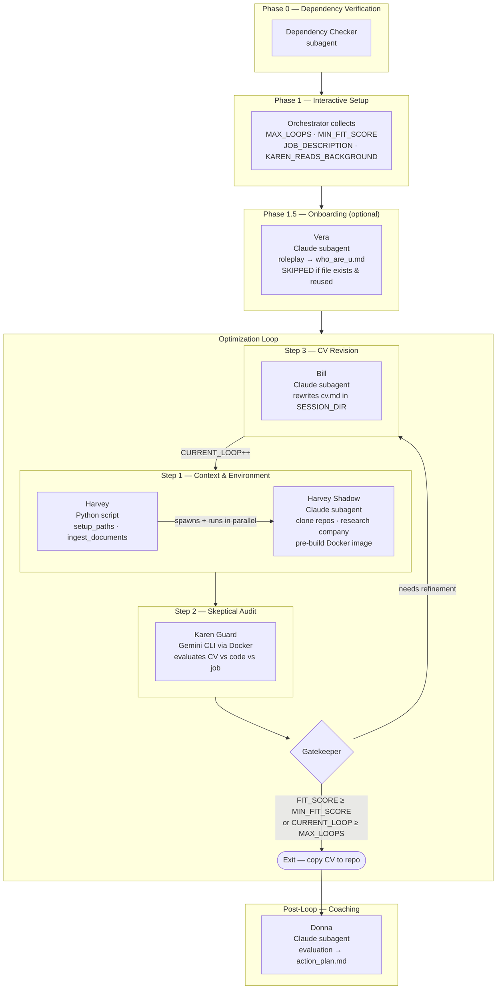

# Execution Runbook: Actor-Critic CV Optimization Loop

Welcome, Agent! You are entering a multi-agent pipeline that iteratively refines a candidate's CV against a job description until an acceptance threshold is met. Read this runbook sequentially. Initialize state variables, execute parallel tasks where instructed, and drive the feedback loop until the termination criteria are satisfied.

## 🗺️ Architecture Overview



---

## 🤖 Global Agent Execution Rules

To ensure reliable, safe, and consistent execution on the host machine, you must strictly adhere to the following rules:

### 1. Shell & Tooling
- **Shell**: Use the system's default shell (e.g., bash/sh) or the user's preferred shell, ensuring commands are compatible.
- **Python projects**: Use `uv` with virtual environment at `.venv/`, activated via `source .venv/bin/activate` (or `activate.fish` if using fish).
- **Display Server**: Use the available display server. If Wayland is active, pipe terminal outputs to `wl-copy` when sharing content for the user.
- **Command Output Capture**: Every shell command must capture output. Never run a command and assume it succeeded. Always check exit codes or append appropriate error-handling checks compatible with the shell being used.
- **Silent Commands**: For commands with no natural output (e.g., `mv`, `mkdir`, `chmod`, `git add`), verify success by appending success indicators (like `&& echo ok` or equivalent).

### 2. Long-Running Task Watchdog
- Before starting any task expected to take >30 seconds, register it:
  `echo (date +%s) $task_description > /tmp/agt_task_active`
- On completion (success or failure), clear it:
  `rm -f /tmp/agt_task_active`
- If a sub-agent or background process is spawned, set a cron to alert if still running after 5 minutes:
  `echo "notify-send 'AGY watchdog' 'Task may be stuck: $task_description'" | at now + 5 minutes`
- If `/tmp/agt_task_active` already exists when starting a new task, report it immediately to the user.

### 3. Execution Style & Scope Discipline
- **Persona**: Direct, no filler. Act like a senior staff engineer.
- **Root Cause First**: Do not patch symptoms. Check for edge cases and security risks before touching anything.
- **Anti-Looping**: If you run the same command or hit the same error twice, **stop**. Analyze why it failed, form a new hypothesis, verify assumptions, then act. If stuck, explain what failed and ask for direction.
- **Scope Discipline**: Do not add features, refactor, or abstract beyond the task. Report failures and skipped steps faithfully.
- **Code Discipline**: No placeholders (`// ... rest of code`). Always write complete code. Read a file before editing it. Check linter output after every change.
- **Language Selection**: Default to shell scripts (bash/sh/fish) + standard Unix tools (`jq`, `awk`, `sed`, `curl`, `fd`, `rg`) for system tasks. Only use Python when libraries have no shell equivalent or logic is genuinely clearer in Python. State why in one sentence before writing Python.
- **Destructive File Ops**: Move files to `/tmp/` (or `.bak`) instead of `rm -rf`. Use plain `rm` only when the user explicitly says "delete", "rm", or "permanently remove".

---

## 🛠️ Phase 0: Dependency Verification (Subagent Delegation)

Before doing anything else, you must verify that all environment dependencies are installed. To avoid saturating your current context, you must delegate the verification checks and any interactive troubleshooting with the user to a specialized subagent.

### List of Required Dependencies:
1. **Python (>=3.13)**
2. **`uv` Package Manager**
3. **Docker** (with permission to run containers without sudo)
4. **`at` command-line utility**
5. **Git**
6. **Wayland clipboard tools (`wl-copy`)** if Wayland display server is active.

### Actions:
1. **Skip if already verified**: Check for the persistent marker at the repository root:
   ```bash
   test -f .dependencies_checked.md && echo verified || echo unverified
   ```
   If `verified`, dependencies were already confirmed on a previous run — skip straight to Phase 1. (Delete `.dependencies_checked.md` to force a re-check.)
2. Spawn a specialized subagent with the role `Dependency Checker`.
3. Instruct the subagent to read, execute, and verify all check steps described in **[requirements.md](../requirements.md)**, communicating directly with the user to help them install any missing tools.
4. Wait for the subagent to complete the task.
5. Verify that `.dependencies_checked.md` was created at the repository root with a successful status check before proceeding.

---

## 🎮 Phase 1: Initialize State (Interactive Setup)

Before executing any commands, you must enter "interactive setup mode".

> [!IMPORTANT]
> **PROMPT INTERACTIVELY — do NOT dump these as plain text.**
> Use your host CLI's native interactive question/option UI (e.g. Claude Code's question prompt, `agy`'s interactive selector) to ask **one question at a time** and **wait for the answer** before moving to the next. Offer the suggested options/defaults as selectable choices where they exist. Only fall back to a plain-text prompt if no interactive UI is available. Never print all questions at once and assume answers.

Ask the user the following questions to initialize the loop configuration variables (always reference them in **UPPERCASE**):

1. **`MAX_LOOPS`**: What is the maximum number of CV refinement iterations allowed? — suggested options: `1`, `3`, `5` (default `3`).
2. **`MIN_FIT_SCORE`**: What is the target minimum technical fit score (0-100) needed to accept the CV? — suggested options: `70`, `80`, `90` (default `80`).
3. **`JOB_DESCRIPTION_RAW`**: Please paste the raw text of the target job description. (free-text input)
4. **`KAREN_READS_BACKGROUND`**: Should Karen Guard be allowed to read the candidate's detailed background (`who_are_u.md`)? — selectable options: `yes` / `no`.

### Initialization Actions:
- Initialize **`CURRENT_LOOP`** to `0`.
- Store `KAREN_READS_BACKGROUND` as an in-context variable (`"yes"` or `"no"`). It will be injected as an environment variable prefix when calling the Harvey Python script (see Step 1).
- Establish the **run history directory** on the host (it persists across iterations and survives `/tmp` cleanup). Store it as **`RUN_DIR`** and seed the score log:
  ```bash
  RUN_DIR=".runs/$(date +%Y%m%d_%H%M%S)" && mkdir -p "$RUN_DIR" && echo "loop,score" > "$RUN_DIR/scores.csv"
  ```
  Reference `RUN_DIR` throughout the loop. Every per-iteration artifact (CVs, Karen's report, score) is archived under it — this is the audit trail for the whole run.
- Write/update `data/docs/job.md` with the following **required format** (so subagents can reliably parse the company name from the first line):
  ```
  # <Position Title> — <Company Name>

  <JOB_DESCRIPTION_RAW verbatim>
  ```
  Example first line: `# Senior Backend Engineer — Acme Corp`

> [!IMPORTANT]
> **SANDBOXING RULE**: During the loop, there are exactly two authorized modifications to `data/docs/cv.md`:
> 1. **Inter-iteration carry-forward** (Step 3, Action 4): the orchestrator copies the revised CV from the previous session to feed it into the next iteration.
> 2. **Final exit copy** (Gatekeeper exit): the final optimized CV is copied back to the repo.
> All other edits to `data/docs/cv.md` are prohibited. Every in-progress revision lives exclusively in `SESSION_DIR/docs/cv.md`.

---

## 🧭 Phase 1.5: Candidate Onboarding (Vera — Optional)

`data/docs/who_are_u.md` is the **source of truth** that Bill uses to rewrite the CV without hallucinating. Before starting the loop, ensure it exists. This phase is optional and is skipped when a usable file is reused.

**Actions:**
1. Check whether the background file already exists:
   ```bash
   test -f data/docs/who_are_u.md && echo exists || echo missing
   ```
2. **Branch on the result:**
   - **`missing`**: Ask the user: *"No candidate background found. Run Vera to create one now? (recommended) [yes/no]"*
     - If **yes** → spawn the `Vera` subagent, instructing it to read and execute [vera_guy/main.md](../vera_guy/main.md) with **`MODE=create`**. Wait for completion and verify `data/docs/who_are_u.md` was written.
     - If **no** → warn the user that Bill will have a weaker source of truth and anti-hallucination guarantees are reduced, then proceed.
   - **`exists`**: Ask the user: *"A candidate background already exists. Reuse it as-is, or refresh it with Vera? [reuse/refresh]"*
     - **`reuse`** → skip Vera entirely. Proceed to the loop. (This is the default fast path.)
     - **`refresh`** → spawn the `Vera` subagent with **`MODE=refresh`** and **`EXISTING_BACKGROUND_PATH=data/docs/who_are_u.md`**. Wait for completion.
3. Once `who_are_u.md` is settled, proceed to the Optimization Loop.

> Vera runs **only here**, before the loop. It never runs during iterations.

---

## 🔁 The Optimization Loop (Play Phase)

Execute the following steps inside a loop. The loop continues while **`CURRENT_LOOP`** < **`MAX_LOOPS`** AND the latest **`FIT_SCORE`** < **`MIN_FIT_SCORE`**.

---

### Step 1: Context Preparation & Environment Setup (Harvey & Harvey Shadow)

Execute the Python setup wrapper to initialize the workspace directory and copy base documents, then delegate all API/cloning background tasks to a specialized subagent to prevent context saturation.

**Command to run (Orchestration Setup):**
```bash
KAREN_READS_BACKGROUND=$KAREN_READS_BACKGROUND uv run python harvey_guy/main.py
```
Substitute `$KAREN_READS_BACKGROUND` with the value collected in Phase 1 (`yes` or `no`).

**Actions:**
1. Write the loop state checkpoint **before** running the command:
   ```bash
   echo '{"current_loop": '$CURRENT_LOOP', "fit_score": '$FIT_SCORE_OR_NULL', "session_id": "previous_or_null"}' > /tmp/karen_guard_loop_state.json
   ```
2. Execute the setup command above.
3. Capture the `stdout` session UUID, and store it as **`SESSION_ID`**. Derive **`SESSION_DIR`** as `/tmp/karen_guard_$SESSION_ID/` — use this exact formula everywhere. Update the checkpoint with the new `session_id`.
4. Spawn a specialized subagent with the role `Harvey Shadow`.
5. Instruct the subagent to read and execute the instructions defined in **[shadow.md](shadow.md)** using the active **`SESSION_ID`** and **`SESSION_DIR`** (`/tmp/karen_guard_$SESSION_ID/`).
6. Wait for the `Harvey Shadow` subagent to complete all execution tasks.
7. Verify that `/tmp/karen_guard_$SESSION_ID/company_info.md` and the cloned repos in `/tmp/karen_guard_$SESSION_ID/repos/` are created and populated before proceeding. If `SESSION_DIR/anti_karen/clone_warnings.txt` exists, read it and report the discrepancy to the user before continuing.

---

### Step 2: Skeptical Auditing (Karen Guard)

Delegate or follow the instructions defined in [karen_guard/main.md](../karen_guard/main.md) to execute the evaluator docker sandbox using the active **`SESSION_ID`**.

> [!WARNING]
> **Pre-flight: Antigravity CLI Authentication**
> The evaluation runs `agy` inside Docker with output fully redirected — interactive login is not possible during the run. Before executing the command below, verify that the host `~/.gemini` directory contains valid credentials. If not authenticated, have the user run `agy` interactively on the host first to complete the login flow, then proceed.

**Command to run:**
```bash
./karen_guard/run.sh $SESSION_ID > /tmp/karen_guard_$SESSION_ID/anti_karen/karen_run.log 2> /tmp/karen_guard_$SESSION_ID/anti_karen/karen_run.err
```

**Actions:**
1. Execute the command above to isolate output logs inside the session directory.
2. Monitor progress by viewing `/tmp/karen_guard_$SESSION_ID/anti_karen/karen_run.err`.
3. Retrieve **`KAREN_REPORT_PATH`** from the last line of `/tmp/karen_guard_$SESSION_ID/anti_karen/karen_run.log`.
4. Open **`KAREN_REPORT_PATH`** and extract **`FIT_SCORE`** by finding the line matching `## Technical Fit Score: <number>/100` and parsing the integer before `/100`.
5. **FIT_SCORE fallback**: If the line is absent, malformed, or the file cannot be opened — **stop the loop immediately**. Report to the user: "Karen did not produce a parseable fit score. Inspect `KAREN_REPORT_PATH` manually." Do not proceed to the Gatekeeper with an undefined score.
6. **Archive this iteration's input + evaluation** into the run history (the CV at `SESSION_DIR/docs/cv.md` is still the version Karen just evaluated — Bill has not run yet):
   ```bash
   ITER_DIR="$RUN_DIR/loop_$(printf '%02d' $CURRENT_LOOP)" && mkdir -p "$ITER_DIR"
   cp /tmp/karen_guard_$SESSION_ID/docs/cv.md "$ITER_DIR/cv_in.md"
   cp "$KAREN_REPORT_PATH" "$ITER_DIR/karen_report.md"
   echo "$FIT_SCORE" > "$ITER_DIR/score.txt"
   echo "$CURRENT_LOOP,$FIT_SCORE" >> "$RUN_DIR/scores.csv"
   ```

---

### 🛑 The Gatekeeper (Evaluation & Termination Check)

Compare your variables:

- **IF** **`FIT_SCORE`** >= **`MIN_FIT_SCORE`**:
  - **Exit Loop — Success**. Copy the final CV: `cp /tmp/karen_guard_$SESSION_ID/docs/cv.md data/docs/cv.md`
  - **Exit Report** → show to user:
    > ✅ Target score reached. Final score: `FIT_SCORE`/100 (target: `MIN_FIT_SCORE`). Iterations: `CURRENT_LOOP + 1`. Optimized CV saved to `data/docs/cv.md`. Full evaluation at `data/evaluation.md`. Run history (per-iteration CVs, reports, `scores.csv`) at `RUN_DIR`.
  - Then run **Post-Loop Coaching (Donna)** below.

- **IF** **`CURRENT_LOOP`** >= **`MAX_LOOPS`**:
  - **Exit Loop — Max cycles reached**. Copy the last CV: `cp /tmp/karen_guard_$SESSION_ID/docs/cv.md data/docs/cv.md`
  - **Exit Report** → show to user:
    > ⚠️ Maximum iterations reached (`MAX_LOOPS`). Best score achieved: `FIT_SCORE`/100 (target: `MIN_FIT_SCORE`). Last CV saved to `data/docs/cv.md`. Full evaluation at `data/evaluation.md`. Run history (per-iteration CVs, reports, `scores.csv`) at `RUN_DIR`. Consider running again with a higher `MAX_LOOPS` or reviewing Karen's recommendations in `data/evaluation.md`.
  - Then run **Post-Loop Coaching (Donna)** below.

- **ELSE**:
  - Proceed to **Step 3 (Bill)**.

---

### Step 3: CV Revision (Bill)

Delegate the CV revision to a specialized subagent. This isolates the editing logic and prevents cluttering the main orchestrator's context.

**Actions:**
1. Spawn a subagent (Bill) to optimize the CV.
2. Instruct the subagent to read and execute the instructions defined in [billf/main.md](../billf/main.md) using the active **`SESSION_ID`** and **`KAREN_REPORT_PATH`**.
3. Wait for the subagent to complete the revision. (The subagent will modify `/tmp/karen_guard_$SESSION_ID/docs/cv.md` directly).
4. **Archive Bill's output** into the same iteration directory (the CV is now the revised version; draft notes are optional):
   ```bash
   ITER_DIR="$RUN_DIR/loop_$(printf '%02d' $CURRENT_LOOP)" && mkdir -p "$ITER_DIR"
   cp /tmp/karen_guard_$SESSION_ID/docs/cv.md "$ITER_DIR/cv_out.md"
   cp /tmp/karen_guard_$SESSION_ID/anti_karen/draft_notes.txt "$ITER_DIR/draft_notes.txt" 2>/dev/null || true
   ```
5. **CV carry-forward** (authorized inter-iteration modification): copy the revised CV so the next iteration's `ingest_documents()` reads Bill's version instead of the original:
   ```bash
   cp /tmp/karen_guard_$SESSION_ID/docs/cv.md data/docs/cv.md
   ```
6. Increment **`CURRENT_LOOP`** by 1.
7. Update the loop state checkpoint:
   ```bash
   echo '{"current_loop": '$CURRENT_LOOP', "fit_score": '$FIT_SCORE', "session_id": "'$SESSION_ID'"}' > /tmp/karen_guard_loop_state.json
   ```
8. Restart the loop from **Step 1**.

---

## 🎓 Post-Loop Coaching (Donna)

Reached only on a Gatekeeper exit (either success or max cycles). The loop is done — now convert Karen's final evaluation into a forward-looking development plan for the candidate.

**Actions:**
1. Spawn a subagent (Donna) for career coaching.
2. Instruct the subagent to read and execute the instructions defined in [donna_guy/main.md](../donna_guy/main.md) using the active **`SESSION_ID`**, **`KAREN_REPORT_PATH`**, **`FIT_SCORE`**, and **`MIN_FIT_SCORE`**.
3. Wait for the subagent to complete. (It writes `data/docs/action_plan.md` and modifies nothing else.)
4. Surface the final summary to the user:
   > 🎓 Action plan ready at `data/docs/action_plan.md` — prioritized technical gaps, interview prep, and public projects to raise your score on the next run.
5. **End of pipeline.**
