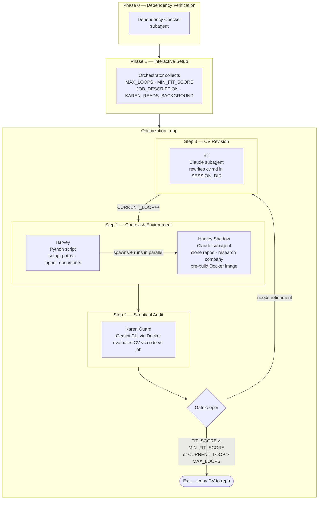

# Execution Runbook: Actor-Critic CV Optimization Loop

Welcome, Agent! You are entering a multi-agent pipeline that iteratively refines a candidate's CV against a job description until an acceptance threshold is met. Read this runbook sequentially. Initialize state variables, execute parallel tasks where instructed, and drive the feedback loop until the termination criteria are satisfied.

## 🗺️ Architecture Overview



---

## 🤖 Global Agent Execution Rules

To ensure reliable, safe, and consistent execution on the host machine, you must strictly adhere to the following rules:

### 1. Shell & Tooling
- **Shell**: Use the system's default shell (e.g., bash/sh) or the user's preferred shell, ensuring commands are compatible.
- **Python projects**: Use `uv` with virtual environment at `.venv/`, activated via `source .venv/bin/activate` (or `activate.fish` if using fish).
- **Display Server**: Use the available display server. If Wayland is active, pipe terminal outputs to `wl-copy` when sharing content for the user.
- **Command Output Capture**: Every shell command must capture output. Never run a command and assume it succeeded. Always check exit codes or append appropriate error-handling checks compatible with the shell being used.
- **Silent Commands**: For commands with no natural output (e.g., `mv`, `mkdir`, `chmod`, `git add`), verify success by appending success indicators (like `&& echo ok` or equivalent).

### 2. Long-Running Task Watchdog
- Before starting any task expected to take >30 seconds, register it:
  `echo (date +%s) $task_description > /tmp/agt_task_active`
- On completion (success or failure), clear it:
  `rm -f /tmp/agt_task_active`
- If a sub-agent or background process is spawned, set a cron to alert if still running after 5 minutes:
  `echo "notify-send 'AGY watchdog' 'Task may be stuck: $task_description'" | at now + 5 minutes`
- If `/tmp/agt_task_active` already exists when starting a new task, report it immediately to the user.

### 3. Execution Style & Scope Discipline
- **Persona**: Direct, no filler. Act like a senior staff engineer.
- **Root Cause First**: Do not patch symptoms. Check for edge cases and security risks before touching anything.
- **Anti-Looping**: If you run the same command or hit the same error twice, **stop**. Analyze why it failed, form a new hypothesis, verify assumptions, then act. If stuck, explain what failed and ask for direction.
- **Scope Discipline**: Do not add features, refactor, or abstract beyond the task. Report failures and skipped steps faithfully.
- **Code Discipline**: No placeholders (`// ... rest of code`). Always write complete code. Read a file before editing it. Check linter output after every change.
- **Language Selection**: Default to shell scripts (bash/sh/fish) + standard Unix tools (`jq`, `awk`, `sed`, `curl`, `fd`, `rg`) for system tasks. Only use Python when libraries have no shell equivalent or logic is genuinely clearer in Python. State why in one sentence before writing Python.
- **Destructive File Ops**: Move files to `/tmp/` (or `.bak`) instead of `rm -rf`. Use plain `rm` only when the user explicitly says "delete", "rm", or "permanently remove".

---

## 🛠️ Phase 0: Dependency Verification (Subagent Delegation)

Before doing anything else, you must verify that all environment dependencies are installed. To avoid saturating your current context, you must delegate the verification checks and any interactive troubleshooting with the user to a specialized subagent.

### List of Required Dependencies:
1. **Python (>=3.13)**
2. **`uv` Package Manager**
3. **Docker** (with permission to run containers without sudo)
4. **`at` command-line utility**
5. **Git**
6. **Wayland clipboard tools (`wl-copy`)** if Wayland display server is active.

### Actions:
1. Spawn a specialized subagent with the role `Dependency Checker`.
2. Instruct the subagent to read, execute, and verify all check steps described in **[requirements.md](../requirements.md)**, communicating directly with the user to help them install any missing tools.
3. Wait for the subagent to complete the task.
4. Verify that `/tmp/dependencies_checked.md` was created with a successful status check before proceeding.

---

## 🎮 Phase 1: Initialize State (Interactive Setup)

Before executing any commands, you must enter "interactive setup mode". Ask the user the following questions to initialize the loop configuration variables (always reference them in **UPPERCASE**):

1. **`MAX_LOOPS`**: What is the maximum number of CV refinement iterations allowed? (e.g., `3`)
2. **`MIN_FIT_SCORE`**: What is the target minimum technical fit score (0-100) needed to accept the CV? (e.g., `80`)
3. **`JOB_DESCRIPTION_RAW`**: Please paste the raw text of the target job description.
4. **`KAREN_READS_BACKGROUND`**: Should Karen Guard be allowed to read the candidate's detailed background (`who_are_u.md`)? (e.g., `yes` / `no`).

### Initialization Actions:
- Initialize **`CURRENT_LOOP`** to `0`.
- Export the environment variable `KAREN_READS_BACKGROUND` based on the user's input (set to `"yes"` or `"no"`), so that the orchestrator uses this choice during ingestion.
- Write/update `data/docs/job.md` with the following **required format** (so subagents can reliably parse the company name from the first line):
  ```
  # <Position Title> — <Company Name>

  <JOB_DESCRIPTION_RAW verbatim>
  ```
  Example first line: `# Senior Backend Engineer — Acme Corp`

> [!IMPORTANT]
> **SANDBOXING RULE**: During the loop iterations, do NOT modify the local repository file [data/docs/cv.md](../data/docs/cv.md). All updates and edits must occur exclusively inside the session directory at `/tmp/karen_guard_$SESSION_ID/docs/cv.md`.

---

## 🔁 The Optimization Loop (Play Phase)

Execute the following steps inside a loop. The loop continues while **`CURRENT_LOOP`** < **`MAX_LOOPS`** AND the latest **`FIT_SCORE`** < **`MIN_FIT_SCORE`**.

---

### Step 1: Context Preparation & Environment Setup (Harvey & Harvey Shadow)

Execute the Python setup wrapper to initialize the workspace directory and copy base documents, then delegate all API/cloning background tasks to a specialized subagent to prevent context saturation.

**Command to run (Orchestration Setup):**
```bash
uv run python harvey_guy/main.py
```

**Actions:**
1. Execute the setup command above.
2. Capture the `stdout` session UUID, and store it as **`SESSION_ID`**. Derive **`SESSION_DIR`** as `/tmp/karen_guard_$SESSION_ID/` — use this exact formula everywhere. At this point `job.md` and `cv.md` have already been copied to `SESSION_DIR/docs/` by the Python script.
3. Spawn a specialized subagent with the role `Harvey Shadow`.
4. Instruct the subagent to read and execute the instructions defined in **[shadow.md](shadow.md)** using the active **`SESSION_ID`** and **`SESSION_DIR`** (`/tmp/karen_guard_$SESSION_ID/`).
5. **⚡ Concurrent Task while Subagent runs:** Inspect the temporary session CV file `/tmp/karen_guard_$SESSION_ID/docs/cv.md` (if already created by a previous loop run) or index the local file [data/docs/cv.md](../data/docs/cv.md) on the first iteration to map technologies.
6. Wait for the `Harvey Shadow` subagent to complete all execution tasks.
7. Verify that `/tmp/karen_guard_$SESSION_ID/company_info.md` and the cloned repos in `/tmp/karen_guard_$SESSION_ID/repos/` are created and populated successfully before proceeding.

---

### Step 2: Skeptical Auditing (Karen Guard)

Delegate or follow the instructions defined in [karen_guard/main.md](../karen_guard/main.md) to execute the evaluator docker sandbox using the active **`SESSION_ID`**.

> [!WARNING]
> **Pre-flight: Antigravity CLI Authentication**
> The evaluation runs `agy` inside Docker with output fully redirected — interactive login is not possible during the run. Before executing the command below, verify that the host `~/.gemini` directory contains valid credentials. If not authenticated, have the user run `agy` interactively on the host first to complete the login flow, then proceed.

**Command to run:**
```bash
./karen_guard/run.sh $SESSION_ID > /tmp/karen_guard_$SESSION_ID/anti_karen/karen_run.log 2> /tmp/karen_guard_$SESSION_ID/anti_karen/karen_run.err
```

**Actions:**
1. Execute the command above to isolate output logs inside the session directory.
2. Monitor progress by viewing `/tmp/karen_guard_$SESSION_ID/anti_karen/karen_run.err`.
3. Retrieve **`KAREN_REPORT_PATH`** from the last line of `/tmp/karen_guard_$SESSION_ID/anti_karen/karen_run.log`.
4. Open **`KAREN_REPORT_PATH`** (or the host copy [data/evaluation.md](../data/evaluation.md)) and extract the **`FIT_SCORE`** (parsed from the "Technical Fit Score" section).

---

### 🛑 The Gatekeeper (Evaluation & Termination Check)

Compare your variables:
- **IF** **`FIT_SCORE`** >= **`MIN_FIT_SCORE`**:
  - **Exit Loop**: The CV has successfully met the user's requirements. Copy the final optimized CV from `/tmp/karen_guard_$SESSION_ID/docs/cv.md` back to the local repository at [data/docs/cv.md](../data/docs/cv.md).
- **IF** **`CURRENT_LOOP`** >= **`MAX_LOOPS`**:
  - **Exit Loop**: Reached maximum cycles. Copy the last iteration's CV from `/tmp/karen_guard_$SESSION_ID/docs/cv.md` back to the local repository at [data/docs/cv.md](../data/docs/cv.md) and report the final status.
- **ELSE**:
  - Proceed to **Step 3 (Bill)**.

---

### Step 3: CV Revision (Bill)

Delegate the CV revision to a specialized subagent. This isolates the editing logic and prevents cluttering the main orchestrator's context.

**Actions:**
1. Spawn a subagent (Bill) to optimize the CV.
2. Instruct the subagent to read and execute the instructions defined in [billf/main.md](../billf/main.md) using the active **`SESSION_ID`** and **`KAREN_REPORT_PATH`**.
3. Wait for the subagent to complete the revision. (The subagent will modify `/tmp/karen_guard_$SESSION_ID/docs/cv.md` directly).
4. Increment **`CURRENT_LOOP`** by 1.
5. Restart the loop from **Step 1**.
