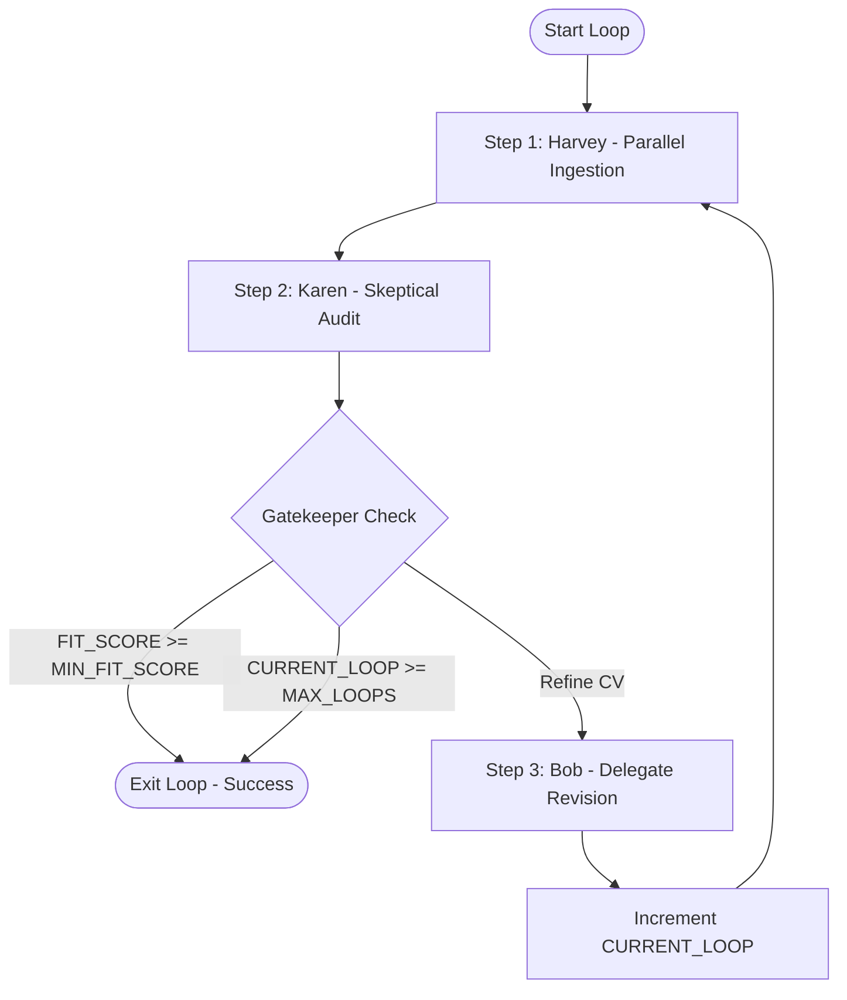

# Execution Runbook: Actor-Critic CV Optimization Loop

Welcome, Agent! You are entering a multi-agent loop designed to refine a candidate's CV against a job description. 
Read this runbook sequentially. You must initialize state variables, run tasks in parallel where instructed, and execute the feedback loop until the acceptance criteria are met.

---

## 🎮 Phase 0: Initialize State (Interactive Setup)

Before executing any commands, you must enter "interactive setup mode". Ask the user the following questions to initialize the loop configuration variables (always reference them in **UPPERCASE**):

1. **`MAX_LOOPS`**: What is the maximum number of CV refinement iterations allowed? (e.g., `3`)
2. **`MIN_FIT_SCORE`**: What is the target minimum technical fit score (0-100) needed to accept the CV? (e.g., `80`)
3. **`JOB_DESCRIPTION_RAW`**: Please paste the raw text of the target job description.

### Initialization Actions:
- Initialize **`CURRENT_LOOP`** to `0`.
- Write/update the parsed job description to [data/docs/job.md](file:///home/alex/git/my/meta_2028/data/docs/job.md) based on the **`JOB_DESCRIPTION_RAW`** input.

> [!IMPORTANT]
> **SANDBOXING RULE**: During the loop iterations, do NOT modify the local repository file `data/docs/cv.md`. All updates and edits must occur exclusively inside the session directory at `/tmp/karen_guard_$SESSION_ID/docs/cv.md`.

---

## 🔁 The Optimization Loop (Play Phase)

Execute the following steps inside a loop. The loop continues while **`CURRENT_LOOP`** < **`MAX_LOOPS`** AND the latest **`FIT_SCORE`** < **`MIN_FIT_SCORE`**.



---

### Step 1: Parallel Context Preparation (Harvey)

Execute Harvey's main entrypoint to setup the directory layout, ingest docs, clone repositories, and research the target company.

**Command to run:**
```bash
uv run python harvey_guy/main.py
```

**⚡ Parallel Execution Instruction for the Agent:**
While the above command is running (which clones repositories and queries APIs), you should spin up a parallel thread or run commands concurrently to:
1. **Parallel Task A**: Monitor the progress of repository clones inside `/tmp/karen_guard_$SESSION_ID/repos/`.
2. **Parallel Task B**: Inspect the temporary session CV file `/tmp/karen_guard_$SESSION_ID/docs/cv.md` (if already created by a previous loop run) or index the local file [data/docs/cv.md](file:///home/alex/git/my/meta_2028/data/docs/cv.md) on the first iteration to map technologies.

**Actions:**
1. Execute the main pipeline command.
2. Capture the `stdout` session UUID, and store it as **`SESSION_ID`**.
3. Verify that `/tmp/karen_guard_$SESSION_ID/company_info.md` and the protected folder `/tmp/karen_guard_$SESSION_ID/anti_karen/` are created successfully.

---

### Step 2: Skeptical Auditing (Karen Guard)

Run the evaluator docker sandbox using the **`SESSION_ID`** from Step 1.

**Command to run:**
```bash
./karen_guard/run.sh $SESSION_ID
```

**Actions:**
1. Execute the command above. All diagnostic prints are routed to `stderr`. 
2. Capture the single output line from `stdout`, which is the absolute path to the generated evaluation report: `/tmp/karen_guard_$SESSION_ID/karen_output.md`. Store this as **`KAREN_REPORT_PATH`**.
3. Open **`KAREN_REPORT_PATH`** (or [data/evaluation.md](file:///home/alex/git/my/meta_2028/data/evaluation.md)) and extract the **`FIT_SCORE`** (parsed from the "Technical Fit Score" section).

---

### 🛑 The Gatekeeper (Evaluation & Termination Check)

Compare your variables:
- **IF** **`FIT_SCORE`** >= **`MIN_FIT_SCORE`**:
  - **Exit Loop**: The CV has successfully met the user's requirements. Copy the final optimized CV from `/tmp/karen_guard_$SESSION_ID/docs/cv.md` back to the local repository at [data/docs/cv.md](file:///home/alex/git/my/meta_2028/data/docs/cv.md).
- **IF** **`CURRENT_LOOP`** >= **`MAX_LOOPS`**:
  - **Exit Loop**: Reached maximum cycles. Copy the last iteration's CV from `/tmp/karen_guard_$SESSION_ID/docs/cv.md` back to the local repository at [data/docs/cv.md](file:///home/alex/git/my/meta_2028/data/docs/cv.md) and report the final status.
- **ELSE**:
  - Proceed to **Step 3 (Bob Revisor)**.

---

### Step 3: CV Revision (Bob Revisor)

Delegate the CV revision to a specialized subagent. This isolates the editing logic and prevents cluttering the main orchestrator's context.

**Actions:**
1. Spawn a subagent (Bob Revisor) to optimize the CV.
2. Instruct the subagent to read and execute the instructions defined in [bob_revisor/main.md](file:///home/alex/git/my/meta_2028/bob_revisor/main.md) using the active **`SESSION_ID`** and **`KAREN_REPORT_PATH`**.
3. Wait for the subagent to complete the revision. (The subagent will modify `/tmp/karen_guard_$SESSION_ID/docs/cv.md` directly).
4. Increment **`CURRENT_LOOP`** by 1.
5. Restart the loop from **Step 1**.
